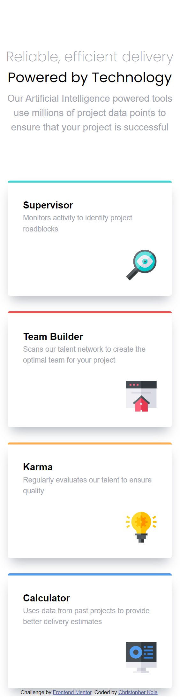
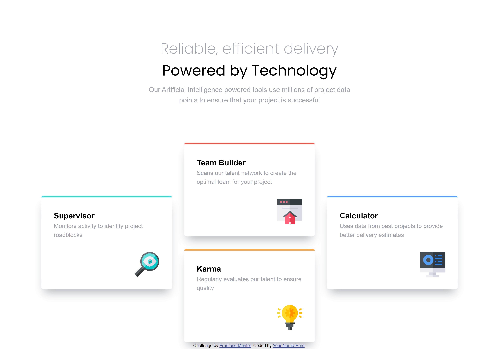

# Frontend Mentor - Four card feature section solution

This is a solution to the [Four card feature section challenge on Frontend Mentor](https://www.frontendmentor.io/challenges/four-card-feature-section-weK1eFYK). Frontend Mentor challenges help you improve your coding skills by building realistic projects.

## Table of contents

- [Overview](#overview)
  - [The challenge](#the-challenge)
  - [Screenshot](#screenshot)
  - [Links](#links)
- [My process](#my-process)
  - [Built with](#built-with)
  - [What I learned](#what-i-learned)
  - [Continued development](#continued-development)
  - [Useful resources](#useful-resources)
- [Author](#author)
- [Acknowledgments](#acknowledgments)

**Note: Delete this note and update the table of contents based on what sections you keep.**

## Overview

### The challenge

Users should be able to:

- View the optimal layout for the site depending on their device's screen size

### Screenshot

#### Mobile display


#### Desktop display


### Links

- Solution URL: [solution URL here](https://www.frontendmentor.io/solutions/four-card-feature-section-created-using-css-grid-pTCASheIsA)
- Live Site URL: [Add live site URL here](https://ckola99.github.io/four-card-feature-section/)

## My process

### Built with

- Semantic HTML5 markup
- CSS custom properties
- Flexbox
- CSS Grid
- Mobile-first workflow

### What I learned

I reinforced my knowledge of CSS grid and I'm proud of my practical use of grid-template-areas.

```css
@media (min-width: 600px) {
	.layout {
		grid-template-areas:
			"... two   ..."
			"one two   four"
			"one three four"
			"... three ...";
	}

	.card:nth-child(1) {
		grid-area: one;
		border-color: hsl(180, 62%, 55%);
	}

	.card:nth-child(2) {
		grid-area: two;
		border-color: hsl(0, 78%, 62%);
	}

	.card:nth-child(3) {
		grid-area: three;
		border-color: hsl(34, 97%, 64%);
	}

	.card:nth-child(4) {
		grid-area: four;
		border-color: hsl(212, 86%, 64%);
	}

	header p {
		font-size: 1.10rem;
	}

	h1 {
		font-size: 2.35rem;
	}
}
```

### Continued development

I would like to have more confidence going forward starting projects with what I think and really try my best to finish them without hand holding.

### Useful resources

no other resources used this time

## Author

- Frontend Mentor - [@CKola99](https://www.frontendmentor.io/profile/Ckola99)
- Twitter - [@Kola.Dev](https://www.twitter.com/KolaDev01)

## Acknowledgments

Shoutout Kevin Powell for the small hints and tricks.
